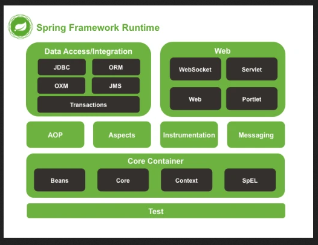

## Spring_1stBean_xml

Маленький проект, использующий Spring + Beans + xml-конфгурацию.

	- откройте проект в IDEA, запустите с помощью alt + shift + F10 (запуск проекта из IDEA).

	- посмотрите на вывод в терминале: появлись строки "Inna" и "my". Объекты создавались 1) с использованием Bean и 2) старым способом. См. в код (файл Main.java).

Проект использует и работает с:

	- OS: Linux (Ubuntu 21.04) 64-bits;
	- IDEA Community Edition;
	- Spring Framework;
	- Maven build tools;
	- Java 8 (JDK 1.8).

~*~ часть 1, разъяснения ~*~

Spring Framework - набор классов и интерфейсов, написанных за нас.

### Библиотека vs Framework
Cпособы оформления переиспользуемого кода:

	Библиотека: есть готовые классы с методами. Методы библиотеки вы просто вызываете из своей программы.

	Фреймворк (Spring): это внешний каркас, предоставляющий заранее определенные точки расширения. В эти точки расширения вы и вставляете свой код, но когда он будет вызван - определяет именно фреймворк. Наследование готовых классов или имплементация интерфейсов => создание своих классов с нужной логикой.

Spring - это модульная структура: data access, web (mvc), core, security и др.

<html></html>

Способы конфигурации приложения
Существует 3 основных способа конфигурации приложения (т.е. указания спрингу какие именно объекты нам нужны для работы):

    - при помощи xml файлов/конфигов: bean + xml - устаревший вариант;
    - при помощи java-конфигов;
    - автоматическая конфигурация: bean + аннотации - принятый вариант сейчас.

Кстати, в папке **main** есть:
- java (свойство "Sources root) папка;
- resources (свойство "Resources root") папка.
(Это обязательные пометки для Maven)

~*~ часть 2, ссылки на материалы ~*~

Links:

	Spring

	"Spring для ленивых. Основы, базовые концепции и примеры с кодом. Часть 1" (а часть 2 - fail)
	https://javarush.ru/groups/posts/spring-framework-java-1

	Spring - Bean - xml
	https://www.youtube.com/watch?v=nLCYk1ySY_U&list=PLAma_mKffTOR5o0WNHnY0mTjKxnCgSXrZ&index=3

	Spring Framework documentation
	https://spring.io/projects

	Maven

	Maven: compiler.source & compiler.target tags
	https://mincong.io/2018/08/29/maven-compiler-plugin-understanding/

	Maven: download dependancies
	https://mvnrepository.com/

	Maven tool window - description
	https://www.jetbrains.com/help/idea/maven-projects-tool-window.html

~*~ часть 3, дополнительно ~*~

Быстрые клавиши, IDEA:

	alt + insert: вызов меню автогенерации (конструкторов и т.п.);

	ps (напечатать в коде программы): дальше всплывает подсказка, что создать, например, метод main() - "psvm";

	alt + shift + F10: запуск проекта из IDEA

Tags: Spring, Application Context, Inversion of Control, Dependency Inversion, Beans, xml, applicationContext.xml, Maven
