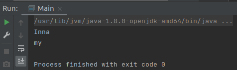

## Spring_1stBean_xml
<html></html>

Маленький проект, использующий Spring + Beans + xml-конфигурацию.

	- откройте проект в IDEA, запустите с помощью alt + shift + F10
		(запуск проекта из IDEA).

	- посмотрите на вывод в терминале: появлись строки "Inna" и "my".

<html></html>

	Объекты создавались 1) с использованием Bean и 2) старым способом. См. в код, файлы:
		- src/main/resources/applicationContext.xml;
		- src/main/java/org/example2/Main.java;
		- src/main/java/org/example2/Testean.java;

<html></html>

Проект использует и работает с:

	- OS: Linux (Ubuntu 21.04) 64-bits;
	- IDEA Community Edition;
	- Spring Framework;
	- Maven build tools;
	- Java 8 (JDK 1.8).

~*~ часть 1, разъяснения ~*~

Spring Framework - набор классов и интерфейсов, написанных за нас.

### Библиотека vs Framework
Cпособы оформления переиспользуемого кода:

	Библиотека: есть готовые классы с методами.
		Методы библиотеки вы просто вызываете из своей программы.

	Фреймворк (Spring): это внешний каркас, предоставляющий заранее определенные точки расширения.
		В эти точки расширения вы и вставляете свой код, но когда он будет вызван -
		определяет именно фреймворк.
		
		Наследование готовых классов или имплементация интерфейсов =>
		создание своих классов с нужной логикой.

Spring - это модульная структура: data access, web (mvc), core, security и др.

<html></html>

Способы конфигурации приложения

Существует 3 основных способа конфигурации приложения (т.е. указания спрингу какие именно объекты нам нужны для работы):

    - при помощи xml файлов/конфигов: beans в xml - устаревший вариант;
    - при помощи java-конфигов: java-класс для описания бинов;
    - автоматическая конфигурация: аннотации + xml - более современный вариант.

Кстати, в папке **main** есть:
- java (свойство "Sources root") папка;
- resources (свойство "Resources root") папка.

(Это обязательные пометки в IDEA для Maven. Настройка свойств: на папке кликнуть пр.кн.м -> Mark Directory as -> "Sources Root"/"Resources Root")

Кстати, в проекте есть папка **./docs/** с разными материалами по теме.

~*~ часть 2, ссылки на материалы ~*~

Links:

	Spring

	"Spring для ленивых. Основы, базовые концепции и примеры с кодом. Часть 1" (а "Часть 2" - definite fail)
	https://javarush.ru/groups/posts/spring-framework-java-1

	Spring - Bean - xml
	https://www.youtube.com/watch?v=nLCYk1ySY_U&list=PLAma_mKffTOR5o0WNHnY0mTjKxnCgSXrZ&index=3

	Spring Framework documentation
	https://spring.io/projects

	Maven

	Maven: compiler.source & compiler.target tags
	https://mincong.io/2018/08/29/maven-compiler-plugin-understanding/

	Maven: download dependancies
	https://mvnrepository.com/

	Maven tool window - description
	https://www.jetbrains.com/help/idea/maven-projects-tool-window.html

~*~ часть 3, дополнительно ~*~

Быстрые клавиши, IDEA:

	alt + insert: вызов меню автогенерации (конструкторов и т.п.);

	ps (напечатать в коде программы): дальше всплывает подсказка,
		что создать, например, метод main() - "psvm";

	alt + shift + F10: запуск проекта из IDEA

Tags: Spring, Application Context, Inversion of Control, Dependency Inversion, Beans, xml, applicationContext.xml, Maven
